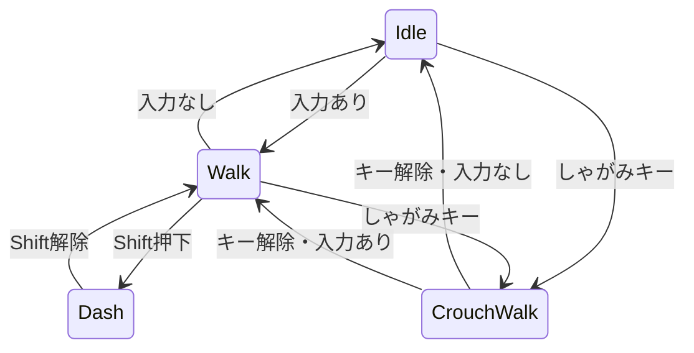
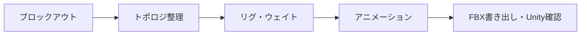

# 猫プレイヤー 3Dモデル仕様書

Sep 25, 2026 · @yukki

## 1. 概要・前提条件

Unity(URP)のPCゲーム向けに、三人称後方視点で操作するトゥーン調の猫プレイヤーモデルを1体制作する。

| 項目 | 決定値 |
| --- | --- |
| エンジン | Unity + URP |
| 対象機種 | PC |
| 視点 | 三人称・後方視点（カメラ距離 約2〜4m） |
| アートスタイル | トゥーン調 |
| 体長 | 0.5m（尻尾を除く） |
| 制作ツール | Blender（GPT-Astra から CLI 経由で操作） |
| アニメーション | 待機・歩き・しゃがみ移動・ダッシュ の4種 |

後方視点のため、背中・尻尾・耳のシルエットを最優先で作り込む。顔は振り向き時に破綻しない品質を確保する。

## 2. モデリング仕様

LOD0は1.5万三角形以下とし、単位・原点・向きはUnityの標準に合わせる。

| 項目 | 仕様 |
| --- | --- |
| 三角形数 | LOD0: 8,000〜15,000 / LOD1: LOD0の50% / LOD2: LOD0の25% |
| 単位 | 1 Unity単位 = 1m（Blenderの単位スケール 1.0） |
| 寸法 | 体長 0.5m、肩高 約0.3m、尻尾 約0.3m |
| 原点 | 4本足の中心の接地点（Y=0） |
| 正面 | Unity上で+Z方向 |
| メッシュ | スキンメッシュ1つ（体）＋目は別マテリアル |
| トポロジ | 肩・肘・膝・足首・首・尻尾の関節にエッジループを3本以上 |
| 作り込み優先度 | 背中・尻尾・耳 > 脚 > 顔 |
| 毛の表現 | 輪郭に出る毛束を形状で作る（シェルファーは使わない） |
| 法線 | アウトライン用にスムーズ法線を頂点カラーへ焼き込む |

## 3. リグ仕様

四足のためUnityのGenericリグとし、ボーンは約40本で構成する。Humanoidは二足歩行専用のため使わない。

| 部位 | ボーン名 | 本数 |
| --- | --- | --- |
| ルート | `Root`（原点・移動なし） | 1 |
| 腰 | `Hips` | 1 |
| 背骨 | `Spine_01`〜`Spine_03` | 3 |
| 首・頭 | `Neck_01`、`Neck_02`、`Head` | 3 |
| 耳 | `Ear_01.L`、`Ear_02.L`（Rも同様） | 4 |
| 前脚 | `FrontLeg_Upper.L`、`FrontLeg_Lower.L`、`FrontFoot.L`、`FrontToe.L`（Rも同様） | 8 |
| 後脚 | `HindLeg_Upper.L`、`HindLeg_Lower.L`、`HindFoot.L`、`HindToe.L`（Rも同様） | 8 |
| 尻尾 | `Tail_01`〜`Tail_08` | 8 |
| 顔 | `Jaw`、`Eye.L`、`Eye.R` | 3 |

- 左右は`.L` / `.R`の接尾辞で区別する。
- 1頂点あたりのウェイトは最大4ボーン（Unityの標準設定）。
- 脚にはBlender内でIKコントローラーを付けて良いが、FBXには変形用ボーンのみ書き出す。

## 4. アニメーション仕様

待機・歩き・しゃがみ移動・ダッシュの4種を、すべて30fps・その場足踏み（In-place、Root Motionなし）のループで制作する。

| クリップ名 | 内容 | 長さ | 想定移動速度 |
| --- | --- | --- | --- |
| `Cat_Idle` | 立ったまま呼吸・尻尾をゆらす | 60f（2秒） | 0 m/s |
| `Cat_Walk` | 通常歩行 | 24f | 1.0 m/s |
| `Cat_CrouchWalk` | 体を低くしたままゆっくり移動 | 32f | 0.5 m/s |
| `Cat_Dash` | 全力疾走（ギャロップ） | 16f | 4.0 m/s |

遷移は0.15秒のクロスフェードでつなぐ。

- 移動速度は初期値。決定後は、足の滑りが出ないようにアニメの歩幅と速度を一致させる。
- しゃがみ中に入力がないときは`Cat_CrouchWalk`を再生速度0で止めて代用する。専用のしゃがみ待機アニメは作らない。
- ループの最初と最後のフレームは同じポーズにする。

## 5. マテリアル・シェーダー仕様

シェーダーはShader Graphで自作するトゥーンシェーダーとし、季節システムから質感を切り替えられる構造にする。

| 項目 | 仕様 |
| --- | --- |
| シェーダー | URP Shader Graphの自作トゥーン（代替案: Unity Toon Shader） |
| 陰影 | ランプテクスチャ（256×8px）で影色を決定 |
| アウトライン | 背面法。頂点カラーのスムーズ法線方向へ押し出す |
| マテリアル数 | 2（体・目） |
| 体テクスチャ | 2048px。ベースカラー、マスク（R: 影の出やすさ / G: 雪の積もりやすさ / B: ハイライト） |
| 目テクスチャ | 1024px。ベースカラーのみ |
| 毛並み | 手描き風のストロークをベースカラーに描き込む |
| 季節差分 | グローバルパラメータ`_SeasonSnowAmount`（0〜1）で、上向きの面とマスクGが重なる部分を白くする |

夏と冬の切り替えは、テクスチャを差し替えずにパラメータだけで行う。四季へ増やす場合も、パラメータを追加するだけで済む。

## 6. Unity組込仕様

FBXで受け渡し、CharacterControllerで操作する。当たり判定はしゃがみ時に低く切り替える。

**BlenderのFBX書き出し設定**

| 項目 | 設定値 |
| --- | --- |
| Scale | 1.0 |
| Apply Scalings | FBX All |
| Forward / Up | -Z Forward / Y Up |
| Apply Transform | オン |
| Add Leaf Bones | オフ |
| Only Deform Bones | オン |
| Bake Animation | オン |

軸の設定は組み合わせで結果が変わるため、Unity上で+Zを向き、Transformの回転が0・スケールが1になることを検収で確認する。

**Unityのインポート設定**

- Rig: Animation Type = Generic、Root node = `Root`
- Animation: 各クリップのLoop Timeをオン
- Model: Mesh Compression = Off

**当たり判定（CharacterController）**

| 状態 | Radius | Height | Center Y |
| --- | --- | --- | --- |
| 通常 | 0.15m | 0.35m | 0.175m |
| しゃがみ | 0.10m | 0.20m | 0.10m |

CharacterControllerは縦向きカプセルしか使えないため、横に長い体の前後は多少壁にめり込む。気になる場合は頭の前に壁検知用のRaycastを追加する。しゃがみ解除時は、頭上に障害物がないかを確認してから元の高さに戻す。

## 7. 制作フロー（GPT-Astra + Blender CLI）

工程を5つに分け、各工程の終わりに自動チェックと目視確認を挟む。AIには工程ごとにこの仕様書の該当表を渡す。

| 工程 | AIに任せる範囲 | 人が確認すること |
| --- | --- | --- |
| ブロックアウト | 寸法どおりの大まかな形 | 後方視点でのシルエット |
| トポロジ整理 | リトポロジ・LOD生成 | 関節のエッジループ |
| リグ・ウェイト | ボーン配置・命名・自動ウェイト | 曲げたときの潰れ（手修正が前提） |
| アニメーション | キーポーズの作成 | 足の滑り・ループの継ぎ目 |
| 書き出し | FBX書き出し | Unity上の向き・スケール |

**自動チェックスクリプト（Blender Python）で検査する項目**

- LOD0の三角形数1.5万以下
- オブジェクトの回転が0・スケールが1（Transform適用済み）
- バウンディングボックスの体長が0.5m±0.02m
- ボーン名が第3章の一覧と一致
- 1頂点あたりのウェイト数が4以下
- アクション名とフレーム数が第4章の表と一致

## 8. 納品・検収

納品物は下記のフォルダ構成と命名規則に従い、チェックリストをすべて満たしたものを完成とする。バイナリはGit LFSで管理する。

| 種類 | パス | 命名例 |
| --- | --- | --- |
| モデル | `Assets/Characters/Cat/Models/` | `CH_Cat.fbx` |
| アニメ | `Assets/Characters/Cat/Animations/` | `Cat_Walk`（FBX内クリップ） |
| テクスチャ | `Assets/Characters/Cat/Textures/` | `T_Cat_Body_BaseColor.png`、`T_Cat_Body_Mask.png` |
| マテリアル | `Assets/Characters/Cat/Materials/` | `M_Cat_Body.mat`、`M_Cat_Eye.mat` |
| ソース | `Source/Cat/`（Assets外） | `CH_Cat.blend` |

**検収チェックリスト**

- [ ] Unity上で+Zを向き、回転0・スケール1で読み込める
- [ ] 体長が0.5mで、原点が足元にある
- [ ] LOD0〜LOD2がLOD Groupで切り替わる
- [ ] 4つのクリップが継ぎ目なくループする
- [ ] 指定速度で動かしたときに足が滑らない
- [ ] アウトラインが関節や耳の角で途切れない
- [ ] `_SeasonSnowAmount`を0→1にしたとき、背中と頭に雪が乗る
- [ ] 後方視点のカメラ距離2〜4mで尻尾・耳のシルエットが読める

## Sources

- [Unity Manual: Model Import Settings — Rig tab](https://docs.unity3d.com/Manual/FBXImporter-Rig.html)
- [Unity Manual: Humanoid Avatars](https://docs.unity3d.com/Manual/AvatarCreationandSetup.html)
- [Unity Manual: Character Controller](https://docs.unity3d.com/Manual/class-CharacterController.html)
- [Unity Toon Shader](https://docs.unity3d.com/Packages/com.unity.toonshader@latest)
- [Blender with OpenAI Astra: Complete Guide](https://kingy.ai/blog/blender-openai-astra-complete-guide/)
